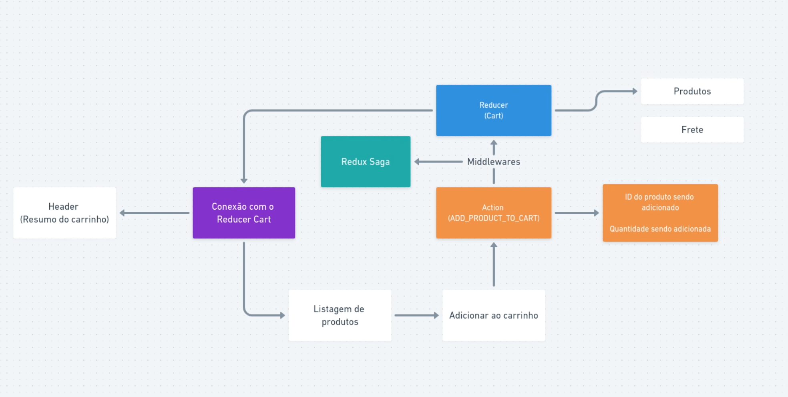

# MY NOTES

## Flux Architecture



---

# REDUX

## Redux store

Redux `store` it's like our global state for the app.

```typescript
// /store

import { createStore } from 'redux';

const sharedData = 'Hello World!';
export const store = createStore(sharedData);
```

## Reducer

Redux `reducer` it's like an isolated state of the app.
A good practice for `reducers` it's to create an initial state and it's interfaces.

```typescript
// /store/modules/cart/reducer.ts

import { Reducer } from 'redux';
import { ICartState } from './types';

const INITIAL_STATE: ICartState = {
  items: [],
};

export const cart: Reducer<ICartState> = () => {
  return INITIAL_STATE;
};
```

## Root reducer

To set more than one `reducer` in our `store`, we can create a `rootReducer` and use `combineReducers` method to export them.

```typescript
// /store/modules/rootReducer.ts

import { combineReducers } from 'redux';
import { cart } from './cart/reducer';

export default combineReducers({ cart });

// /store

import { createStore } from 'redux';
import rootReducer from './modules/rootReducer';

export const store = createStore(rootReducer);
```

## Actions

Redux `actions` are functions that call a `reducer`.
An `action` must have a _`type`_ prop, and can have a _`payload`_ to send data to `reducer`.

PS: The whole logic and business rules must be the responsibility of each `reducer`. Each `action` is only responsible for calling a `reducer` and sending it data.

```typescript
// /store/modules/cart/actions.ts

import { IProduct } from './types';

export function addProductToCart(product: IProduct) {
  return {
    type: 'ADD_PRODUCT_TO_CART',
    payload: { product },
  };
}
```

## Calling a reducer with `useDispatch`

To call this function properly, we had to use `useDispatch` hook.

```typescript
// /components/Cart

export const Catalog = () => {
  const dispatch = useDispatch();

  const handleAddProductToCart = useCallback(
    (product: IProduct) => {
      dispatch(addProductToCart(product));
    },
    [dispatch]
  );

  return (
    <h1>Catalog</h1>
    <button type="button" onClick={() => handleAddProductToCart(product)}>
      Buy
    </button>
  );
};
```

## Reducer props

A `reducer` have two params: first the `store` current state, and second the `action` that have called this `reducer`.

```typescript
// /store/modules/cart/reducer.ts

export const cart: Reducer<ICartState> = (state = INITIAL_STATE, action) => {
  return state;
};
```

## Why each action need a type?

Remember that prop _`type`_ created in each `action`? That props it's used for `reducer` identify which function it have to execute.

```typescript
// /store/modules/cart/reducer.ts

export const cart: Reducer<ICartState> = (state = INITIAL_STATE, action) => {
  switch (action.type) {
    case 'ADD_PRODUCT_TO_CART': {
      console.log('That scope must be executed');
      return state;
    }
    default: {
      console.log('That scope should not be executed');
      return state;
    }
  }
};
```

## Immutable concept and Immer

Just like react states, we also have to use the `immutable` concept to change our redux state (`store`).
There is a lib called `immer` that makes this proccess much easier. With `immer` you can write mutable code in a `draft` and the library convert the `draft` into a new immutable data for you.

```typescript
// /store/modules/cart/reducer.ts

/* immutable concept using spread operators */
return {
  ...state,
  items: [
    ...state.items,
    {
      product,
      quantity: 1,
    },
  ],
};

/* immutable concept using immer */
return produce(state, (draft) => {
  draft.items.push({
    product,
    quantity: 1,
  });
});
```

## Getting access to state data with `useSelector`

We can access the global state data with redux `useSelector` method which receive a `callback` paramater and return the data that you specifies on callback (in this case `state.cart.item`).

Also, it have two `dynamic params`, the first one represents the `global state type`, and the second one represent the callback `return type`.

```typescript
// /components/Cart

const cart = useSelector<IState, ICartItem[]>((state) => state.cart.items);

// global state type = IState
// callback return type = ICartItem[]
```

## Debugging with redux devtools

We can use the browser extension `redux dev tools`, to debug our redux states. With this extension we have access to our redux calls, diffs between each call and also navigate into a timeline. To set-up this extension we just need to install the `redux-devtools-extension` library and add this code in our `store`.

```typescript
// /store

import { createStore } from 'redux';
import { composeWithDevTools } from 'redux-devtools-extension';

export const store = createStore(rootReducer, composeWithDevTools());
```

---

# REDUX SAGA

Redux `saga` it's responsible for manage middlewares that can intercept `actions` before they call `reducers`.

## Creating sagas

When you call an `action` more than once and the first call didn't finish yet, you can choose how your `middleware` will work. Here some examples:

- `takeLatest`: run for the latest and discard the rest.
- `takeLeading`: run for the first and discard the rest.
- `takeEvery`: run for the each call.

Each `take` receive two params, the first one is the prop type of an `action` that will be watched and the second one is the function that will be called.

```typescript
// /store/modules/cart/sagas.ts

import { all, takeLatest } from 'redux-saga/effects';

function checkProductStock() {
  console.log('intercept "ADD_PRODUCT_TO_CART" action');
}

export default all([takeLatest('ADD_PRODUCT_TO_CART', checkProductStock)]);
```

## Add saga middlewares to store

Just like `reducers`, we can also create different sagas and joining then into a `rootSaga`.

PS: `function*` is similar to an `async function` and `yield` is similar to an `await`.

```typescript
// /store/modules/rootSaga.ts

import { all } from 'redux-saga/effects';

import cart from './cart/sagas';

export default function* rootSaga() {
  return yield all([cart]);
}

// /store

import { applyMiddleware, createStore } from 'redux';
import { composeWithDevTools } from 'redux-devtools-extension';
import createSagaMiddleware from 'redux-saga';

import rootReducer from './modules/rootReducer';
import rootSaga from './modules/rootSaga';

const sagaMiddleware = createSagaMiddleware();
const middlewares = [sagaMiddleware];

export const store = createStore(
  rootReducer,
  composeWithDevTools(applyMiddleware(...middlewares))
);

sagaMiddleware.run(rootSaga);
```

## Actions patterns

To keep `actions` organized and also be possible to use `sagas` in a better way. You can separate each `action` in three parts, one for the action `request`, another for `success` and another for `failure`.

```typescript
export enum ActionTypes {
  addProductToCartRequest = 'ADD_PRODUCT_TO_CART_REQUEST',
  addProductToCartSuccess = 'ADD_PRODUCT_TO_CART_SUCCESS',
  addProductToCartFailure = 'ADD_PRODUCT_TO_CART_FAILURE',
}

export function addProductToCartRequest(product: IProduct) {
  return {
    type: ActionTypes.addProductToCartRequest,
    payload: { product },
  };
}

export function addProductToCartSuccess(product: IProduct) {
  return {
    type: ActionTypes.addProductToCartSuccess,
    payload: { product },
  };
}

export function addProductToCartFailure(productId: number) {
  return {
    type: ActionTypes.addProductToCartFailure,
    payload: { productId },
  };
}
```

## Saga methods

Whenever you use any `saga` methods, you need to use `yield` before calling it. Here some useful methods.

### `call`

It is used to call api's or promises in general. Receive the api method as first param and it's url as second param.

```typescript
const availableStockResponse: AxiosResponse<IStockResponse> = yield call(
  api.get,
  `stock/${product.id}`
);
```

### `put`

It is similar to `dispatch`, it's used to call an `action`.

```typescript
yield put(addProductToCartSuccess(product));
```

### `select`

Used to get data from redux global state.

```typescript
const currentQuantity: number = yield select((state: IState) => {
  return (
    state.cart.items.find((item) => item.product.id === product.id)?.quantity ??
    0
  );
});
```

### `all`

It's similar to `promise.all` method. It is used to call more than one saga method at the same time.

```typescript
export default all([
  takeLatest(ActionTypes.addProductToCartRequest, checkProductStock),
]);
```
